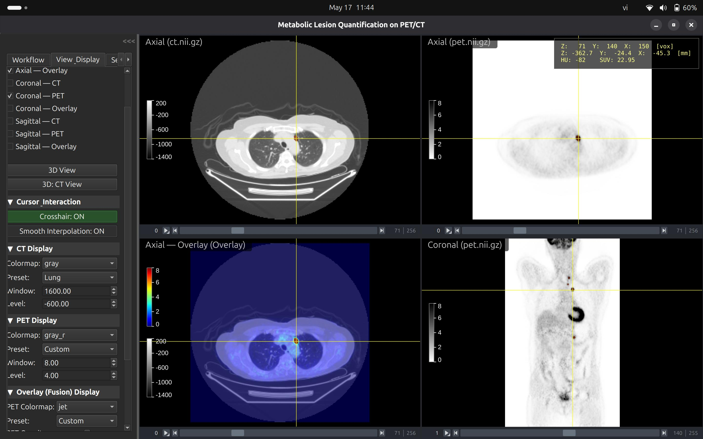
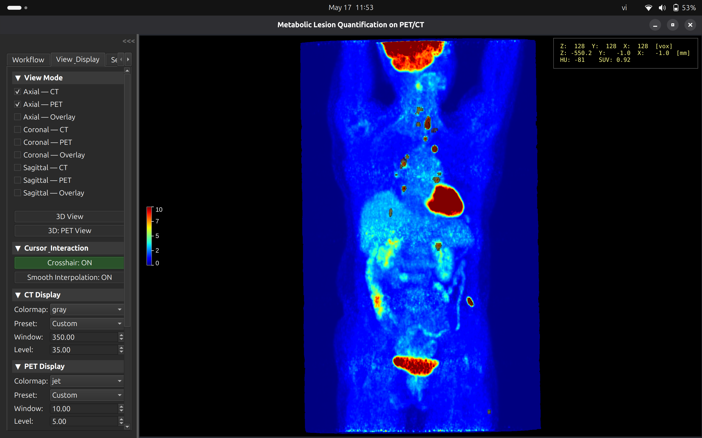

# PET/CT Segmentation Application

<div align="center">
  <h3>A desktop application for PET/CT image segmentation, refinement, and quantification.</h3>
</div>

## Project Overview

This project is a desktop application built with Python, PyQt6, and Napari, designed for medical professionals and researchers to process PET/CT imaging data. It provides an end-to-end workflow from loading NIfTI files to running AI-driven segmentation, manual refinement, and generating clinical quantifications (SUVmax, SUVmean, MTV, gTLG).

Key features:
*   **Multi-Modal Visualization:** Interactive orthogonal (grid) views, fusion (overlay) layouts, and 3D volume rendering powered by Napari.
*   **Automated AI Segmentation:** Dockerized nnU-Net backend for rapid tumor segmentation with real-time inference progress.
*   **Precision Refinement Tools:** Paint/Eraser 3D brushes, SUV-based thresholding, and Iterative Thresholding.
*   **Clinical Quantification:** Automatic calculation of lesion metrics and global Total Lesion Glycolysis (gTLG) with precise voxel volume formulation.
*   **Persistent Storage:** Local SQLite database integrated with SQLAlchemy for robust session management.

---

## Demonstration Video

[Demo Video Link](https://www.youtube.com/watch?v=SIUKj6J8gxI&t=1s)

## Screenshots

<div align="center">
  
  <p><em>Multi-modal PET/CT viewer with orthogonal grid layout</em></p>

  
  <p><em>3D volume rendering of PET scan</em></p>
</div>

---

## Architecture Summary

The application is structured as a monolith with two main components:

1.  **GUI Application (Host):** The frontend desktop app handles user interaction, rendering, and logic synchronization.
2.  **AI Engine (Docker):** The nnU-Net engine runs in an isolated Docker container to avoid dependency conflicts (PyTorch, CUDA).
    *   `engine_nnunet_old_ver`: Tumor segmentation with patch-level inference progress streaming.
3.  **Communication:** The GUI sends NIfTI volumes over HTTP and receives binary masks from the engine. A `/progress` endpoint streams per-patch inference progress to the GUI in real time.

---

## Model Weights

**Model weights are not distributed in this repository.** To obtain the weights, contact the project author.

Once you have the weights, place them under:

```
AI_engines/engine_nnunet_old_ver/weights/
├── nnUNet_results/
│   ├── nnUNetTrainer_150epochs__nnUNetPlans__3d_fullres/
│   │   └── fold_0/
│   └── nnUNetTrainerDicewBCELoss_1vs50_150ep__nnUNetPlans__3d_fullres/
│       └── fold_0/
├── nnUNet_preprocessed/
└── nnUNet_raw/
```

The `start.sh` / `start.bat` scripts will build the Docker image (with weights baked in) automatically on first run.

### nnU-Net Library Patch

This project applies a small patch to the nnU-Net library to expose per-patch inference progress via a callback. The stock `tqdm` loop inside `predict_from_raw_data.py` is replaced with an optional `_progress_callback` hook:

**File:** `.venv/lib/python3.13/site-packages/nnunetv2/inference/predict_from_raw_data.py`

Find the inner prediction loop (inside `predict_sliding_window_return_logits`) and replace the `tqdm`-wrapped loop with:

```python
# PETCTApp patch: replace tqdm (invisible on headless server) with an optional
# progress callback so the FastAPI layer can expose patch-inference progress
# via the /progress endpoint.
_pcb = getattr(self, '_progress_callback', None)
_total = len(slicers)
for _i, sl in enumerate(slicers):
    if _pcb is not None:
        try:
            _pcb(_i, _total)
        except Exception:
            pass
    workon = data[sl][None]
    workon = workon.to(self.device, non_blocking=False)

    prediction = self._internal_maybe_mirror_and_predict(workon)[0].to(results_device)

    predicted_logits[sl] += (prediction * gaussian if self.use_gaussian else prediction)
    n_predictions[sl[1:]] += (gaussian if self.use_gaussian else 1)
if _pcb is not None:
    try:
        _pcb(_total, _total)
    except Exception:
        pass
```

After applying the patch, rebuild the Docker image: `./start.sh` will detect the change on next run (or choose "Rebuild" when prompted).

---

## Installation & Setup

See [README_SETUP.md](README_SETUP.md) for full GPU driver and Docker setup instructions.

To run the AI engine efficiently, an **NVIDIA GPU is highly recommended**.

### Quick Start (Linux)

```bash
# On Linux
./start.sh

# On Windows
.\start.bat
```

The script will automatically:
1. Load environment variables from `.env`.
2. Build the Docker image for the nnU-Net engine (weights must be present — see above).
3. Start the container with GPU passthrough enabled.
4. Launch the PyQt6 GUI.

---

## Project Structure

```text
PETCTApp_Monolith/
├── src/                          # Main PyQt app (GUI, core logic, database)
├── AI_engines/
│   └── engine_nnunet_old_ver/    # Dockerized nnU-Net backend (FastAPI, port 8104)
│       ├── weights/              # Model weights (not tracked in git — see above)
│       ├── src/                  # Engine source code
│       ├── main.py               # FastAPI app
│       └── Dockerfile
├── storage/                      # SQLite database and NIfTI session files
├── tests/                        # Test suite
├── start.sh / start.bat          # Launchers (build Docker + run GUI)
└── pyproject.toml                # Python dependencies (managed by uv)
```
